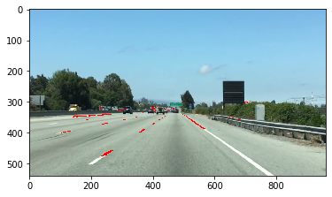

## 计算机视觉——颜色选取

```python
import matplotlib.pyplot as plt 
import matplotlib.pyplot as mpimg 
import numpy as np 

# 读取图片
image = mpimg.imread("test.jpg")

# 获取x和y大小，并复制两份图像
# 使用一个副本，我们将只提取满足我们选择的像素，
# 然后我们将这些像素画成红色的原始图像，以看到我们的选择覆盖在原始图像上。
ysize = image.shape[0]
xsize = image.shape[1]
color_select = np.copy(image)
line_image = np.copy(image)

# 定义我们的颜色标准 
red_threshold = 200
green_threshold = 200
blue_threshold = 200
rgb_threshold = [red_threshold, green_threshold, blue_threshold]


# 定义感兴趣的三角形区域 
# 请记住，在图像处理中，原点(x=0，y=0)位于左上角。
# 注：如果运行此代码，则会发现这些值不是合理的值！但你很快就会有机会和他们一起玩 
left_bottom = [0, 539]
right_bottom = [900, 300]
apex = [400, 0]

fit_left = np.polyfit((left_bottom[0], apex[0]), (left_bottom[1], apex[1]), 1)
fit_right = np.polyfit((right_bottom[0], apex[0]), (right_bottom[1], apex[1]), 1)
fit_bottom = np.polyfit((left_bottom[0], right_bottom[0]), (left_bottom[1], right_bottom[1]), 1)

# 对低于阈值的像素进行遮罩
color_thresholds = (image[:,:,0] < rgb_threshold[0]) | \
                    (image[:,:,1] < rgb_threshold[1]) | \
                    (image[:,:,2] < rgb_threshold[2])

# 在线内找到区域
XX, YY = np.meshgrid(np.arange(0, xsize), np.arange(0, ysize))
region_thresholds = (YY > (XX*fit_left[0] + fit_left[1])) & \
                    (YY > (XX*fit_right[0] + fit_right[1])) & \
                    (YY < (XX*fit_bottom[0] + fit_bottom[1]))

# 遮罩颜色选区
color_select[color_thresholds] = [0,0,0]
# 找出图像在哪里都是彩色的，右边的和在区域内的 
line_image[~color_thresholds & region_thresholds] = [255,0,0]

#显示两张输出的图像
plt.imshow(color_select)
plt.imshow(line_image)

```


    <matplotlib.image.AxesImage at 0x13aad6b3a90>





在遮罩范围内，将白色像素点遮罩为红色像素。
